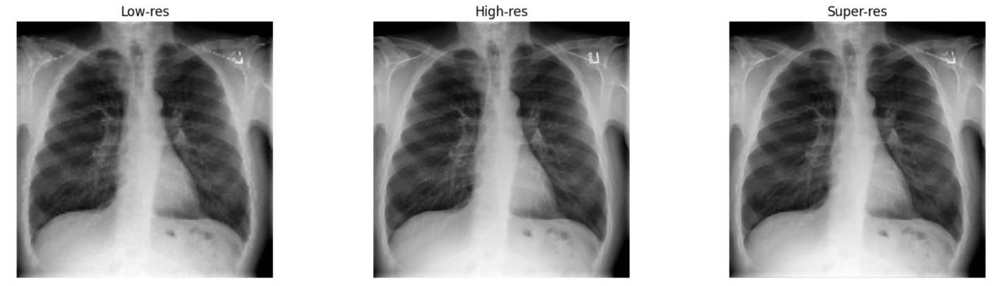
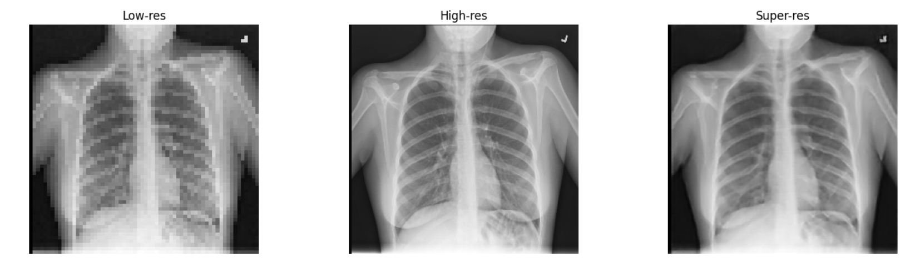
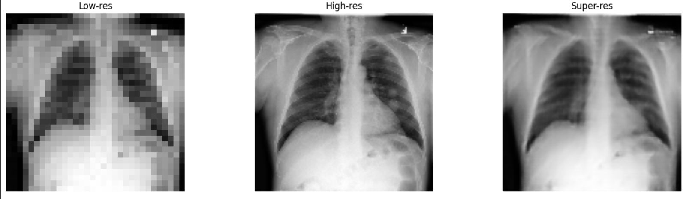

# Image Super-Resolution Enhancement for Chest X-rays

## 🚀 Project Overview

This project focuses on **image super-resolution enhancement**, specifically applied to **Chest X-ray images**. By leveraging advanced techniques, including **Enhanced Super-Resolution Generative Adversarial Networks (ESRGAN)**, we upscale low-resolution medical images into higher resolutions with exceptional fidelity and detail. This enables resolution enhancements such as:

- From `32x32` to `128x128`
- From `64x64` to `256x256`
- From `128x128` to `512x512`  
  ...and beyond, transforming diagnostic imaging quality to support better healthcare outcomes.

## 🌟 Importance of Super-Resolution in Chest X-rays

High-resolution Chest X-rays are critical in medical diagnostics, particularly for:

- **Early Detection:** Identifying subtle anomalies in the lungs, such as small nodules or lesions.
- **Improved Diagnosis:** Enhancing the clarity of radiographic images for accurate interpretation.
- **Telemedicine:** Upscaling low-quality scans from remote locations for effective online consultations.
- **Research and Education:** Enabling detailed analysis of pathological features.

This project is a significant step toward improving medical imaging quality, especially in resource-limited settings, where low-resolution scans are more common.

## 🔑 Key Features

1. **4x Upscaling Capability:** Enhance Chest X-rays by 4x or more while preserving critical diagnostic details.
2. **ESRGAN-Based Enhancement:** Utilizes **Enhanced Super-Resolution GANs** to produce realistic and detailed high-resolution images.
3. **Specialized for Medical Imaging:** Optimized to handle the unique features of X-ray images.
4. **Customizable Framework:** Easily adaptable for other medical imaging modalities (e.g., CT, MRI).

## 🤖 Role of ESRGAN in Super-Resolution

**Enhanced Super-Resolution Generative Adversarial Networks (ESRGAN)** power this project to achieve state-of-the-art results. ESRGAN improves on traditional SRGAN by:

- **Replacing the Loss Function:** Incorporates a **perceptual loss** that enhances finer details and texture realism.
- **Improving the Generator:** Uses a Residual-in-Residual Dense Block (RRDB) for better learning and higher-quality outputs.
- **Boosting Stability:** Includes a **Relativistic Discriminator** for improved adversarial training.

This architecture ensures that the generated high-resolution images are both visually convincing and diagnostically accurate.

## 📊 Dataset: Chest X-ray

The dataset used in this project consists of Chest X-ray images sourced from:

- **ChestX-ray14 Dataset:** A large-scale dataset containing over 10,000 images.
- The dataset is preprocessed to include low-resolution versions of images for training and validation purposes. High-resolution counterparts are used for comparison and model evaluation.

## 📈 Results Visualization

The project includes result visualization to compare the input and output images side by side. Below is an example:

Input (32\*32) >> Output (128\*128)

Input (64\*64) >> Output (256\*256)

Input (128\*128) >> Output (512\*512)

Metrics such as **PSNR (Peak Signal-to-Noise Ratio)**, **SSIM (Structural Similarity Index)**, and **MSE (Mean Squared Error)**are calculated to validate the enhancement quality.

PSNR: 32.9906
SSIM: 0.9257
MSE: 0.0006

## Contributors 

<table>
  <tr>
    <td align="center">
    <a href="https://github.com/Muhannad159" target="_black">
    
     
    <b>Muhannad Abdallah</b></a>
    </td>
  <td align="center">
    <a href="https://github.com/AliBadran716" target="_black">
    
     
    <b>Ali Badran</b></a>
    </td>
     <td align="center">
    <a href="https://github.com/ahmedalii3" target="_black">
    
     
    <b>Ahmed Ali</b></a>
    </td>
<td align="center">
    <a href="https://github.com/ossama971" target="_black">
    
     
    <b>Osama Badawi</b></a>
    </td>
      </tr>
 </table>
